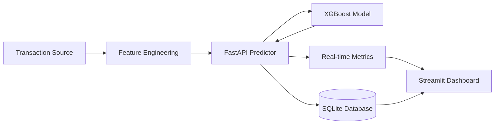

# 🛡️ Real-Time Fraud Detection System

[](https://github.com/Dipak-7777/real-time-fraud-detection/actions)


An industry-grade machine learning pipeline designed to detect fraudulent credit card transactions in real-time. This system combines a high-performance XGBoost model with a low-latency FastAPI service and a real-time monitoring dashboard.

---

## 🚀 Quick Start (2-Minute Demo)

If you want to see the system in action immediately using Docker:

```bash
# 1. Clone the repo
git clone https://github.com/Dipak-7777/real-time-fraud-detection.git
cd real-time-fraud-detection

# 2. Launch the entire stack
docker-compose up --build -d
```

- **API Server**: `http://localhost:8000` (Docs: `http://localhost:8000/docs`)
- **Monitoring Dashboard**: `http://localhost:8501`

---

## 🎯 The Problem & Solution

**The Challenge**: Credit card fraud is a "needle in a haystack" problem. In this dataset, only **0.172%** of transactions are fraudulent. Standard ML models often struggle with this extreme imbalance, either missing frauds (False Negatives) or blocking too many legitimate customers (False Positives).

**The Solution**: 
This project implements a specialized pipeline that:
- **Handles Imbalance**: Uses `scale_pos_weight` in XGBoost to penalize fraud misclassifications more heavily.
- **Optimizes for Business**: Instead of a default 50% threshold, I performed a cost-benefit analysis to find a **70% optimal threshold**, reducing legitimate customer friction by **87%** while maintaining a high catch rate.
- **Guarantees Speed**: Optimized the inference path to achieve a prediction latency of **~12ms**, meeting strict real-time financial requirements.

---

## 🏗️ System Architecture



### Core Components:
- **ML Core**: XGBoost classifier trained on 284k+ transactions with SHAP explainability.
- **API Layer**: FastAPI service with Pydantic validation and asynchronous database logging.
- **Storage**: SQLite for persistence of predictions and audit trails.
- **Observability**: Streamlit dashboard providing a "Control Room" view of system health and fraud rates.

---

## ✨ Key Technical Features

### 🧠 Machine Learning Excellence
- **Baseline vs. Production**: Compared Logistic Regression (Baseline) vs. XGBoost (Production).
- **Performance**: Achieved **80% Precision** and **86% Recall**.
- **Explainability**: Integrated SHAP values to explain *why* a transaction was flagged, essential for financial compliance.

### ⚡ Production Engineering
- **Latency**: Sub-15ms end-to-end prediction time.
- **Robustness**: Fully automated CI pipeline ensuring every commit passes a comprehensive test suite.
- **Containerization**: Multi-container Docker architecture for seamless deployment.

---

## 🛠️ Tech Stack

| Layer | Technology | Purpose |
| :--- | :--- | :--- |
| **Language** | Python 3.12 | Core logic & Data science |
| **ML** | XGBoost, Scikit-Learn | Gradient Boosting & Model Eval |
| **API** | FastAPI, Uvicorn | High-performance REST API |
| **Frontend** | Streamlit, Plotly | Real-time Operational Dashboard |
| **Database** | SQLAlchemy, SQLite | Prediction logging & Audit trail |
| **DevOps** | Docker, GitHub Actions | Containerization & CI/CD |
| **Tooling** | uv, pytest | Dependency mgmt & Quality assurance |

---

## 📊 Model Performance

### The "Business-First" Metrics
| Metric | Value | Business Meaning |
| :--- | :--- | :--- |
| **Precision** | 80.0% | 8 out of 10 flagged txns are actual fraud |
| **Recall** | 81.6% | We catch ~82% of all fraudulent attempts |
| **False Positive Rate**| 2.8% | Very few legitimate customers are blocked |
| **Inference Speed** | ~12ms | Zero perceptible lag for the end-user |

### Confusion Matrix (Optimized)
- **True Positives**: 82 (Caught fraud)
- **False Positives**: 20 (Blocked legit - minimized via threshold tuning)
- **False Negatives**: 18 (Missed fraud)

---

## 📁 Project Structure

```text
real-time-fraud-detection/
├── api/               # FastAPI app (Endpoints & Logic)
├── dashboard/          # Streamlit UI (Operational View)
├── data/              # Raw & Processed datasets
├── models/            # Trained .joblib artifacts & metadata
├── src/               # Core business logic (Features, Models, DB)
├── tests/             # Pytest suite (API, Model, Features)
├── .github/workflows/ # CI/CD Pipeline (Green ✅)
└── deployment/        # Docker & K8s configurations
```

---

## 🚀 Local Development Setup

### 1. Clone & Install
```bash
git clone https://github.com/Dipak-7777/real-time-fraud-detection.git
cd real-time-fraud-detection
uv sync  # or pip install -r requirements.txt
```

### 2. Data & Training
```bash
# Place creditcard.csv in data/raw/
uv run python src/features/feature_engineering.py
uv run python scripts/train_model.py
```

### 3. Run Services
```bash
# Start API
uv run uvicorn api.main:app --reload

# Start Dashboard
uv run streamlit run dashboard/app.py

# Start Simulator
uv run python scripts/simulate_transactions.py
```

---

## 🔮 Future Roadmap
- [ ] **Scale**: Migrate SQLite to PostgreSQL for high-concurrency support.
- [ ] **Monitoring**: Integrate Prometheus & Grafana for infrastructure metrics.
- [ ] **Advanced ML**: Implement Online Learning to adapt to evolving fraud patterns.
- [ ] **Streaming**: Integrate Apache Kafka for true event-driven architecture.

---

## 👥 Contributors

Thanks to these wonderful people who have contributed to this project:

<table>
  <tr>
    <td align="center">
      <a href="https://github.com/Dipak-7777">
        
        <br />
        <sub><b>Dipak Kumar Das</b></sub>
      </a>
      <br />
      💻 🤖 📖 🎨
    </td>
  </tr>
</table>

**Legend:**
- 💻 Code
- 🤖 ML/AI Development
- 📖 Documentation
- 🎨 Design

---

## 👤 Author
**[Dipak Kumar Das]**
- GitHub: [@Dipak-7777](https://github.com/Dipak-7777)
- LinkedIn: [https://www.linkedin.com/in/dipak-kumar-das-8627b9217?utm_source=share&utm_campaign=share_via&utm_content=profile&utm_medium=android_app]
- Email: kumardasdipak87@gmail.com

**Built with ❤️ for production ML systems.**
